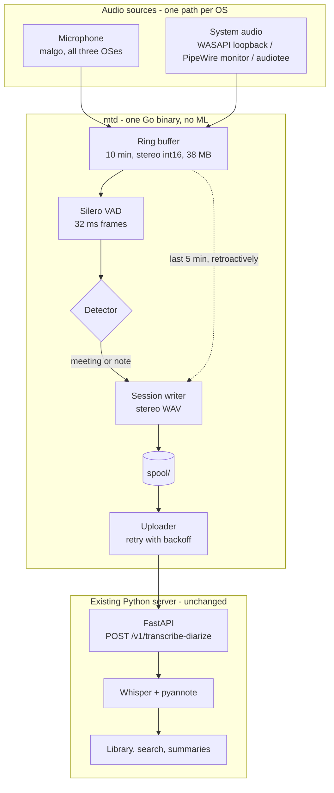
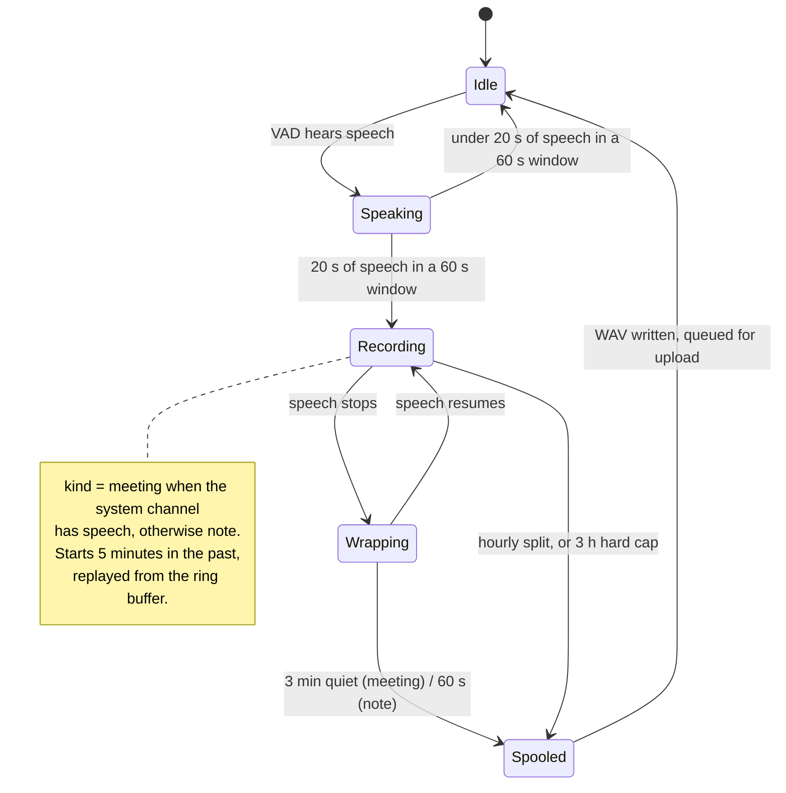

# The always-on listener

A meeting is only transcribed if somebody remembered to start the recording. This
document designs `mtd` — a small background daemon that removes that "if".

It listens all the time, keeps the last few minutes in memory, works out on its own
when a meeting is happening, and hands the recording to the server that already
exists. Nothing about the current app changes.

## The rule this design is built around

**The server does not change.** Not `app/`, not `web/`, not `tests/`, not
`pyproject.toml`. The daemon is a separate Go module in `daemon/` that speaks to the
public HTTP API through the same two endpoints the web UI already uses:

- `POST /v1/transcribe-diarize` — a meeting, with speakers
- `POST /v1/transcribe` — a note, no speakers

This is not a promise, it is a checkable property. Any change that is part of the
daemon must leave this empty:

```bash
git diff --stat -- app/ web/ tests/ pyproject.toml
```

Two independent gates, and both stay green: `uv run pytest` for the app that already
works, `go test ./...` for the daemon. Not running `mtd` leaves the app behaving
exactly as it does today — it is a separate binary, separately installed, opt-in.

Later phases may want server-side work (per-channel diarization, a re-index
endpoint). Those are separate changes, with the full suite green, and they are not
part of this design.

## Architecture



No transcription in Go, no diarization in Go, no model management in Go, no database.
The daemon's entire job is: capture, decide, write a file, upload it. Its only state
is a spool directory, which is why it can be killed at any moment and lose nothing
but the ring buffer.

## Where the audio comes from

Two streams, always. The microphone alone is not enough: on a call with headphones it
captures only you, and the other participants are simply absent from the recording.

| OS | Microphone | System audio | Cost |
|----|-----------|--------------|------|
| **Windows** | `malgo` (WASAPI) | `malgo` — `DeviceType Loopback` | ~20 lines |
| **Linux** | `malgo` (PulseAudio/ALSA) | `malgo` — the PipeWire/PulseAudio `.monitor` source is an ordinary capture device | ~20 lines |
| **macOS** | `malgo` (CoreAudio) | [`audiotee`](https://github.com/makeusabrew/audiotee) as a subprocess | ~80 lines |

miniaudio's loopback is **WASAPI only**, so `malgo` cannot capture system audio on
macOS at all. macOS needs Core Audio process taps (`AudioHardwareCreateProcessTap`,
macOS 14.2+) — an Objective-C API. Rather than write and maintain that binding,
`mtd` spawns `audiotee`: an MIT-licensed Swift CLI that already does exactly this and
writes raw PCM to stdout, logs to stderr. With `--sample-rate 16000` it hands back
16 kHz signed 16-bit little-endian mono, which is the format the ring buffer wants,
so the Go side is a pipe read and nothing else. No cgo, no Objective-C, no manual
retain/release, and a crash in the tap cannot take the daemon down with it.

`audiotee` carries an explicit "API unstable, subject to change" warning, has no
tagged releases, and states MIT only in its README — there is no LICENSE file in the
repository. So the build pins commit `56ac954` (2026-03-31) rather than tracking HEAD.
It compiles in 37 seconds to a 322 KB binary against Swift 6.3.3.

Its stderr is JSON lines, not prose, which is better than it needed to be: a
`metadata` message declares the exact wire format before any audio arrives, and
`stream_start` marks where the PCM begins. Measured on this machine, the tap is
native 48 kHz mono and `--sample-rate 16000` converts it, announcing
`{"encoding":"pcm_s16le","sample_rate":16000,"channels_per_frame":1,"bits_per_channel":16}`.
The daemon reads that message and refuses to start if it ever says something else,
rather than trusting the flag.

**A refused permission looks exactly like a working tap.** Verified: with the
permission ungranted, `AudioHardwareCreateProcessTap` returns status 0, the device
starts, the stream begins — and every sample is zero. There is no error anywhere.
This is why the daemon measures the level of both channels at startup and reports a
dead channel in the tray instead of silently recording half a meeting as silence.

macOS attributes the grant to the *responsible application bundle*, not to the
executable that opens the tap. That is what makes the fixed bundle identifier below
load-bearing, and it is why the permission must be granted to `mtd.app` itself.

Where the tap is unavailable — a Linux box with bare ALSA and no PipeWire — the
daemon runs with the microphone alone and says so in the tray. It degrades; it does
not fail. Every Mac this is built for runs a current macOS, so there the tap is
always available.

## Two channels, one file

The session is written as a **stereo WAV: left is the microphone, right is the
system audio**. Three things fall out of that, and the first is the reason for it:

**No echo cancellation is needed.** The other participants arrive clean from the tap
instead of through the room. Hyprnote keeps a whole AEC crate for the problem this
sidesteps.

**The server needs no change to accept it.** Verified against the installed version,
not assumed: `faster_whisper.audio.decode_audio` has the signature
`(input_file, sampling_rate=16000, split_stereo=False)`, and
[app/media.py](app/media.py) calls it without that argument. Stereo is downmixed to
mono automatically. The daemon uploads a two-channel file, and today's pipeline
treats it exactly like every other recording.

**The separation is preserved on disk for later.** Per-channel diarization is already
on the backlog as "multi-channel recordings". When it gets built, the recordings are
already in the right shape — nothing has to be captured again.

One honest edge: with no headphones, the microphone also picks up the speakers, so
the same audio lands in both channels a few milliseconds apart, and the mono downmix
combs. The cheap fix is to cross-correlate the two channels and mute the system
channel when they agree — the room mic already has everything in that case. Roughly
fifteen lines, and not needed for the first version.

## When a session starts, and what kind it is



**Capturing system audio makes the detection almost trivial, and that is the main
reason to do it early.** Speech on the right channel means somebody is talking to
you, which means this is a call. Speech on the left channel only means you are
talking to yourself.

- **meeting** — speech on the system channel → `POST /v1/transcribe-diarize`
- **note** — speech on the microphone alone → `POST /v1/transcribe`, no diarization

That is the whole classifier. No process enumeration, no window-title scraping, no
per-OS `probe_*.go`, no calendar. Every one of those was in an earlier draft of this
design and the system channel removes the need for all of them. They come back only
as a fallback where the tap is unavailable, and only then.

**Sessions start in the past.** The ring buffer holds the last 10 minutes, so the
moment the detector fires, the session is written starting 5 minutes earlier. This is
the feature: forgetting to press record stops being a category of problem.

Hysteresis keeps it from flapping: 20 seconds of speech within a 60-second window to
start, three minutes of quiet to end a meeting, sixty seconds to end a note. A
recording is split every hour and capped at three, so a stuck session costs one hour
of audio rather than everything.

## Layout

```
daemon/
  cmd/mtd/               flags, wiring, the -probe level meter
  internal/source/       malgo capture; audiotee subprocess on darwin
  internal/vad/          Silero through onnxruntime_go
  internal/session/      ring buffer, detector, WAV writer, the recorder loop
  internal/upload/       spool -> HTTP with backoff
  internal/config/       one TOML file
  internal/tray/         menu bar item, pause
  internal/bundled/      finds the three files that ship beside the binary
  packaging/darwin/      Info.plist and the LaunchAgent
```

All platform difference lives in `source`, behind one interface that returns a
stereo frame; nothing above it branches on GOOS.

### Dependencies, and what each one buys

Versions checked against the Go module proxy on 2026-08-30, not from memory.

| Module | Version | Last release | What it buys |
|---|---|---|---|
| `github.com/gen2brain/malgo` | v0.11.26 | 2026-08-18 | capture on all three OSes, plus WASAPI loopback |
| `github.com/yalue/onnxruntime_go` | v1.35.0 | 2026-08-19 | the runtime Silero needs |
| `fyne.io/systray` | v1.12.2 | 2026-06-09 | tray icon and pause |
| `github.com/kardianos/service` | v1.3.0 | 2026-07-06 | launchd, systemd and Windows service behind one API |

**VAD is Silero, not WebRTC.** WebRTC VAD would avoid shipping the ONNX runtime, but
it was built to detect silence rather than speech and is [notably weak on
music](https://picovoice.ai/blog/best-voice-activity-detection-vad/) — at a 5% false
positive rate Silero makes roughly four times fewer errors. Since the daemon's whole
job is to ignore sounds that are not a conversation, that is the wrong corner to cut.
The price is `onnxruntime` (~20 MB) shipped beside the binary.

Both existing Go wrappers for Silero are stale — `streamer45/silero-vad-go` last
released v0.2.1 in July 2024, `plandem/silero-go` has no releases at all. So `mtd`
calls `onnxruntime_go` directly through about 80 lines: Silero's signature is
`(input, state, sr) -> (output, state)` and the wrapper adds nothing worth depending
on a dead repository for.

## What it costs

Measured on an M3 Max, with the daemon installed and running under launchd:

| | idle | recording |
|---|---|---|
| CPU | **2.4%** of one core | **2.7%** |
| Memory (`top`) | **87 MB** | ~95 MB |
| Resident (`ps` RSS) | **143 MB** | ~150 MB |

Of that, 38 MB is the ring buffer, allocated whole at startup — ten minutes of
stereo int16 at 16 kHz, 3.8 MB per minute — and most of the rest is the ONNX
runtime. The two figures differ because RSS counts shared pages the process only
maps; both are given because quoting whichever is smaller would be cheating.

**Those numbers took a fix to reach.** The first measurement was **237% CPU and
274 MB**, on a machine doing nothing else. ONNX Runtime defaults to one thread
per core and a pool that spin-waits between calls, which for a 1.8 MB model asked
one question every 32 ms is absurd. One intra-op thread, one inter-op thread,
sequential execution and `allow_spinning=0` took CPU to the table above.

Memory needed a second look too. The mixer hands out a fresh 2 KB frame
thirty-one times a second, and at the default the collector lets the heap grow to
twice the live set — which, on a program that is idle anyway, is paying memory
for CPU nobody wants back. `debug.SetGCPercent(40)` took RSS from 201 MB to
143 MB with no measurable change in CPU.

Both of these are worth the paragraph because nothing about the code looked
wrong. They were found by measuring, and only by measuring.

Capture pauses when the tray is paused. Uploads wait while a recording is in
progress — borrowed from [screenpipe](https://docs.screenpi.pe/architecture),
which defers Whisper while the CPU is busy — so the machine is not asked to
transcribe the first hour of a meeting while the second hour is still being
recorded.

## When things go wrong

- **The audio device disappears** — headphones unplugged mid-call. `malgo` reports
  the stop; capture restarts after two seconds and the session continues. The gap is
  silence, which the server's VAD pass trims anyway.
- **The server is down** — sessions accumulate in the spool and the tray shows how
  many are waiting. Nothing is lost and nothing is deleted; when the spool passes a
  size limit the daemon warns rather than dropping the oldest.
- **ONNX will not load** — fatal at startup with an instruction that says what to do,
  in the style of `_no_weights` in [app/engines.py](app/engines.py).
- **The tap is denied** — `audiotee` produces no audio if the permission is refused,
  so the daemon detects a silent right channel at startup, falls back to microphone
  only, and says so in the tray rather than recording half a meeting in silence.
- **The daemon dies** — the only state is the spool directory. It restarts and loses
  the ring buffer, nothing else.

## How it is tested

The project's rule applies unchanged: stub the model, never the code around it.

- **Synthetic WAVs** — silence, music, a monologue, a two-voice dialogue — run
  through the *real* Silero and the *real* state machine. What is asserted is the
  decision: music alone starts nothing, a monologue becomes a note, a dialogue on the
  system channel becomes a meeting.
- **A fake source** feeds sample frames where the device would be. The ring buffer
  and the WAV writer are the real ones, so a bug in either shows up.
- **A fake HTTP server** for the uploader: 202, 500, timeout, and a restart with a
  full spool.
- **A real meeting, by hand**, before it is called done — with the tray, the
  permissions and both channels checked in the resulting file.

## Shipping it

| OS | Packaging | Permissions the user grants |
|---|---|---|
| **macOS** | `.app` bundle (systray and microphone both require one), `audiotee` and the runtime inside it, signed with a local certificate (`make cert`) or ad-hoc | Microphone, and System Audio Recording |
| **Windows** | signed exe, Task Scheduler or service via `kardianos/service` | Microphone |
| **Linux** | tarball plus a systemd user unit | Microphone (portal), PipeWire monitor access |

cgo is unavoidable — `malgo` needs it, so does `onnxruntime_go` — which means one CI
runner per OS instead of cross-compiling from one machine. That is not a real loss:
macOS needs a Mac runner for signing and notarization regardless.

**There is no Developer ID and no notarization.** The bundle is ad-hoc signed
(`codesign -s -`) and colleagues clear the download quarantine once, then approve the
two permissions in System Settings.

That makes one build detail load-bearing: **the bundle identifier must never change.**
macOS ties a TCC grant to the code signature, so rebuilding under a different identity
means the permission is requested again — or quietly refused while the daemon records
silence. The ad-hoc signature and a fixed identifier are therefore part of the build
step itself, applied the same way every time, not something done by hand afterwards.

## Recording other people

Always-on capture of conversations with other people is not a neutral act, and in the
EU it generally requires that they know. So: a tray icon that is visibly different
while recording, a pause that takes one click and takes effect immediately, audio
that never leaves the machine, and a configuration that refuses any upload target
other than a loopback address unless it is changed deliberately.

## Running it

From the project root, `make install` sets up both halves — the app and the
listener — and starts them. `daemon/` on its own has the narrower targets:

```bash
cd daemon
make probe       # eight seconds of level meter on both channels
make install     # the listener only
make uninstall
```

The first launch asks for the microphone and for system audio recording. Both
have to be granted to **mtd.app**, not to a terminal: macOS attributes the grant
to the responsible application bundle.

Settings live in `~/Library/Application Support/mtd/mtd.toml`, written on first
run with comments. The log is `/tmp/mtd.log`.

### What the menu bar offers

**○** listening, **● REC** recording, **◐ REC** wrapping up, **❙❙** paused. The
menu shows the phase and how long it has been going, and hides anything it has
nothing to say about — the count of recordings waiting to be sent appears only
when there are some, and "cannot reach the app" only when that is true.

- **Open transcripts** — the Library, which is the point of all of this
- **Record now** — for the meeting the detector cannot see: everybody in one
  room, nothing playing through the speakers. A forced recording ignores silence,
  because an in-person meeting has long pauses, and runs until it is stopped or
  the three-hour cap is reached.
- **Pause listening** — one click, immediate, and it closes cleanly whatever was
  open rather than truncating it
- **Show recordings folder** — the spool

## What the implementation found

Four things that were not in the design, and are now load-bearing.

**Silero does not score the 512 samples it is given.** It wants the last 64
samples of the previous hop in front of them, 576 in total, and its Python
wrapper does this silently so nothing documents it. Fed a bare 512, real speech
scored **0.003** instead of 1.0 — a broken-looking model rather than a missing
prefix. Found by a test that ran the recording the daemon made of itself through
the real detector; a stubbed VAD would have hidden it completely, and the daemon
would have recorded nothing, ever.

**Real speech is about 88% speech frames.** Twenty seconds of somebody talking
is roughly seventeen and a half seconds of detections, so `start_speech = "20s"`
in practice needs some twenty-three seconds of talking. Worth knowing before
tuning it.

**The first launch after `make install` takes about a minute.** Not where it
was first assumed: the ONNX runtime loads in 91 ms. The wait is macOS vetting a
freshly signed bundle before it will let it near the microphone — measured at
63 s the first time and 0.3 s every time after, and it cost two end-to-end runs
before the log said where the time was going. The daemon now announces both
phases and reports how long each took, because a minute of silence at startup
looks exactly like a hang.

**The menu bar item has to come up before the microphone does.** Opening the
devices first meant that a missing permission showed as *no icon at all* — the
one state in which a person most needs to be told something, and the one in
which they were told nothing. The tray now appears immediately and names the
problem, and the capture loop retries every fifteen seconds, so granting the
permission is enough: nothing has to be restarted.

**A permission dialog looks exactly like a hang.** `ma_device_init` blocks until
macOS has an answer, and when there is a dialog on screen that answer is a
person. Measured: two full minutes with nothing in the log. The daemon now says
what it is waiting for after four seconds, and fails with the fix — which
System Settings pane, which two switches — rather than with a timeout.

Related: **an ad-hoc signature changes with every rebuild**, and macOS ties the
grant to it, so a rebuilt listener is asked for again. That is genuinely
maddening while developing, and it does not need an Apple Developer account to
fix. `make cert` writes a self-signed code-signing certificate into the login
keychain; signing with a *certificate* rather than ad-hoc makes the requirement
"this bundle id, signed by this certificate", which no amount of rebuilding
disturbs. The build picks the identity up on its own when it exists and says
which one it used. Apple charges for a certificate they vouch for; nothing here
needs anybody but this machine to believe it.

**One machine, one listener.** With two instances running — trivially arranged
by double-clicking the app while launchd already has it going — the same meeting
was recorded twice, and the second Core Audio tap came up silent, so its copy was
filed as a note. A pid lock in the spool directory now refuses the second
listener, and a lock left behind by a crash is taken over rather than treated as
a reason not to start.

**A recording is only visible to the uploader once it is finished.** It is
written as `.part` and renamed on close, so a half-written meeting can never be
sent. Relying on "do not upload while recording" would have made that a matter
of timing rather than of structure. A `.part` file left by a daemon that died
mid-write holds no readable audio — the WAV header is patched on close — so it
is discarded at startup with a line saying how much was lost.

## What was verified, end to end

With the daemon installed and running under launchd, and nobody pressing
anything:

```
recording started   kind=meeting replayed=20s
recording finished  kind=meeting length=50s why=quiet
sent                recording="meeting 2026-08-30 22:39.wav" to=/v1/transcribe-diarize took=157ms
uploaded            recordings=1 pending=0
```

and in the Library, from the unchanged server:

```
meeting 2026-08-30 22:39.wav — transcribe_diarize — completed
duration 50.2s, speech 23.9s, language en, speakers SPEAKER_00 and SPEAKER_01
  [11.6s] Good morning everyone. Thanks for joining the planning call...
  [21.3s] Second item is the transcription daemon, which now records both...
  [28.1s] Third, we need to decide who owns the deployment for the release...
```

The 20 seconds of preroll are in that file: the recording begins before the
detector fired.

Resilience was checked the same way. With the server stopped, a meeting was
recorded, kept in the spool, and retried at 5 s, 10 s and 20 s; when the server
came back it was sent without anybody touching it.

## Still to do

**Phase 2 — the awkward cases.** Channel-correlation muting for working without
headphones. Calendar, if false positives turn out to justify it — the plan is to
run for a week first and look, not to guess.

**Windows and Linux are written but unproven.** Their system-audio paths — WASAPI
loopback and the PipeWire monitor source — are a few lines each and compile, but
neither has been run on the platform it is for. cgo means each needs its own
build machine, which is also true of the signing, so this waits for a CI matrix.

## Deliberately not built

No transcription, VAD trimming or diarization in Go — that is what the server is for,
and it is already measured. No database, no UI beyond the tray, no configuration
beyond one TOML file. No Android: `gomobile` and foreground services are a separate
world that does not come free with Go. No calendar integration in phase 1. No process
enumeration at all unless phase 2 proves it necessary.

## Open questions

- **How long should the ring buffer be?** Ten minutes is a guess. It is one constant
  and 3.8 MB per minute, so it is cheap to revisit once there is a week of real use.
- **Does twenty seconds of speech in sixty mean a conversation?** Also a guess, and
  the one most likely to be wrong in both directions. A week of real use answers it;
  until then it stays a constant in one place.
