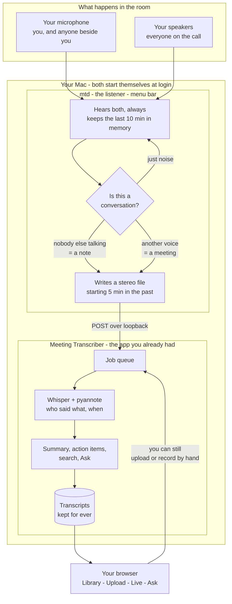

# Meeting Transcriber

Transcription, speaker diarization, search and summaries for meeting and
workplace recordings — audio or video, uploaded or live from the microphone.
FastAPI + [faster-whisper](https://github.com/SYSTRAN/faster-whisper) +
[pyannote.audio](https://github.com/pyannote/pyannote-audio) +
[Agno](https://github.com/agno-agi/agno), on GPU or CPU from the same code.
[RESEARCH.md](RESEARCH.md) explains how the stack was chosen.

It comes in two halves, and both start themselves when you log in:

- **the app** — transcribes, finds who spoke, summarises, and serves the web UI
- **the listener** — sits in the menu bar, hears meetings happening, and hands
  them to the app. You never press record.

Working on this code? [CLAUDE.md](CLAUDE.md) records the conventions it is held
to, and [ROADMAP.md](ROADMAP.md) what is worth building next and why.

## Start here

```bash
make install
```

That is the whole installation. It sets both halves to start at login, starts
them now, and prints where to look. macOS will ask for the **microphone** and for
**system audio recording** — grant both to `mtd.app`, or the other participants
will not be recorded.

Then just have a meeting. When it is over, the transcript is in the Library.

```bash
make open      # the web UI
make status    # is everything running?
make logs      # follow both logs
make uninstall # stop both; transcripts and recordings are kept
```

In the menu bar, **○** means listening, **● REC** means recording. Clicking it
gives you *Open transcripts*, *Record now* for a meeting the listener cannot hear
(everyone in one room, nothing on the speakers), and *Pause listening*.

### If you are going to rebuild it

```bash
make cert     # once, before the first install
```

An ad-hoc signature contains a hash of the binary, and macOS ties the microphone
permission to that hash — so every rebuild is a different application, and it
asks again. `make cert` creates a local self-signed code-signing certificate in
your keychain, which is a *stable* identity: sign with it and the permission
survives every rebuild afterwards. No Apple Developer account, no sudo, and the
key never leaves the machine. Grant the permission once more after the first
signed install, and that is the last time.

## How it fits together



The listener never transcribes anything itself — it only decides *when* to
record and hands the file over. Everything you already used keeps working
exactly as before: Upload, Live, Library, Voices, search and Ask do not know it
exists, and turning it off changes nothing about them.

The two channels are the trick. Your microphone alone would capture only you on
a call with headphones; the system audio is where everyone else is. Keeping them
apart is also how the listener tells a meeting from you thinking aloud — a voice
on the system channel means somebody is talking to you.

## Setup

```bash
uv sync && uv run prek install --prepare-hooks # add UV_TORCH_BACKEND=auto for matching CPU/CUDA PyTorch wheels
cp .env.example .env                           # then set MT_HF_TOKEN
uv run fastapi run app/main.py                 # or `fastapi dev` while developing
```

Or with Docker:

```bash
docker compose up --build                              # CPU
TORCH_BACKEND=cu128 docker compose up --build          # NVIDIA, after uncommenting the GPU block
docker compose --profile scale up --scale worker=3     # extra transcription capacity
```

Diarization uses gated weights: accept the conditions on
[speaker-diarization-community-1](https://huggingface.co/pyannote/speaker-diarization-community-1)
and put a [read token](https://huggingface.co/settings/tokens) in `MT_HF_TOKEN`.
Transcription alone needs no token; summaries and semantic search need
`MT_LLM_API_KEY` (or `OPENAI_API_KEY`).

The web UI is at <http://localhost:8000/>, the OpenAPI docs at `/docs`.

The server answers within a few seconds: PyTorch, pyannote and the LLM SDKs are
imported only when a job, a live session or a summary actually needs them. The
models themselves are downloaded on first use &mdash; several gigabytes, once &mdash; and
cached in `MT_MODEL_CACHE` (or `~/.cache/huggingface`). The startup log prints
that path and how much is already there, and each load logs whether it came from
the cache or was downloaded:

```
INFO app.main:    Database sqlite:///data/jobs.db, media in /srv/data/media
INFO app.main:    Model cache /cache/huggingface (0.00 GB already downloaded)
INFO app.main:    Ready as all
INFO app.main:    Device: cuda (batching True)
INFO app.engines: Loading large-v3-turbo (cuda, float16). Cache /cache/huggingface holds 0.00 GB
INFO app.engines: Loaded large-v3-turbo in 74s, downloaded 1.62 GB
```

Set `MT_PRELOAD_MODELS=true` to move that wait to startup instead of the first job.

## What happens to a recording

Anything FFmpeg can open is accepted — **video included**. PyAV ships with
faster-whisper, so an MP4, MOV or MKV is opened in-process, its audio track is
pulled out and the file itself is kept on disk for playback beside the
transcript. No `ffmpeg` binary, no temporary conversions.

The decoded waveform then goes through **one Silero VAD pass**, and only the
speech is kept. Whisper and pyannote both work on that shortened signal, so
neither ever spends time on the quiet stretches of a meeting, and every
timestamp they produce is mapped back onto the original recording. A recording
that is half silence takes roughly half as long to process. Turn it off with
`MT_TRIM_SILENCE=false`.

Whisper is also prone to writing plausible sentences over silence; segments
whose no-speech probability is high *and* whose log-probability is low are
dropped, and every segment carries a `confidence` the UI underlines when it is
low.

## API

Each upload returns a job immediately; poll it and watch `progress` climb.

| Method | Path | Purpose |
|---|---|---|
| `POST` | `/v1/transcribe` | Speech to text with timestamps and confidence |
| `POST` | `/v1/diarize` | Who spoke when, plus talk-time analytics |
| `POST` | `/v1/transcribe-diarize` | Text with a speaker on every turn |
| `WS` | `/v1/stream` | Live transcription; recorded and kept as a job |
| `GET` | `/v1/jobs?q=&status=` · `/v1/jobs/{id}` | Browse past jobs, or fetch one |
| `GET` | `/v1/jobs/{id}/media` | The stored recording, audio or video |
| `DELETE` | `/v1/jobs/{id}` | Forget a recording: transcript, notes, links, media |
| `POST` | `/v1/jobs/{id}/summary` | Overview, chapters, decisions, action items |
| `PATCH` | `/v1/jobs/{id}/speakers` | Correct speaker names, and learn those voices |
| `POST` | `/v1/jobs/{id}/share` | A read-only link, valid for `MT_SHARE_DAYS` |
| `GET` `POST` | `/v1/jobs/{id}/comments` | Notes pinned to a moment in the recording |
| `GET` | `/v1/search?q=` | Passages from every past meeting |
| `POST` | `/v1/ask` | An answer drawn from those passages, with sources |
| `POST` `GET` `DELETE` | `/v1/people` | Known voices |
| `GET` | `/health` · `/health/ready` | Liveness, and whether the models load |

All upload endpoints accept `vocabulary`; the diarizing ones also accept
`num_speakers`, or `min_speakers` and `max_speakers`.

```bash
JOB=$(curl -s -X POST "localhost:8000/v1/transcribe-diarize?vocabulary=Kubernetes,Priya" \
        -F file=@standup.mp4 | jq -r .id)
curl -s localhost:8000/v1/jobs/$JOB | jq '{status, progress, metrics}'
curl -s -X POST localhost:8000/v1/jobs/$JOB/summary | jq .summary.chapters
curl -s -X POST localhost:8000/v1/ask -H 'content-type: application/json' \
     -d '{"question":"what did we decide about the migration?"}' | jq
```

```json
{
  "duration": 47.0,
  "speech_duration": 31.2,
  "language": "en",
  "speakers": ["Priya", "SPEAKER_01"],
  "segments": [
    { "start": 0.0, "end": 6.4, "speaker": "Priya", "text": "Morning everyone.", "confidence": 0.94 }
  ],
  "analytics": {
    "speech_seconds": 31.2, "silence_seconds": 15.8, "overlap_seconds": 1.4,
    "speakers": [{ "speaker": "Priya", "seconds": 18.0, "share": 0.57, "turns": 4, "longest_turn": 9.1 }]
  }
}
```

### Known voices

Post 15–30 seconds of one person to `/v1/people`, or simply correct a speaker's
name on a finished transcript — `PATCH /v1/jobs/{id}/speakers` stores that
voice too. An uploaded sample is diarized before it is accepted: a second voice in
the clip, or less than `MT_ENROL_MIN_SECONDS` of speech, is refused with the reason,
because that one sample is compared against every meeting from then on. Every later
meeting where the voice is recognised adds another sample, and once `MT_SAMPLES_PER_PERSON`
are stored the most redundant one makes way, so a new headset is still learnt.
[VOICES.md](VOICES.md) explains the mechanism, with diagrams, and what could be
done better.

### Live transcription

Connect to `ws://host/v1/stream?identify=false&vocabulary=`, send 16 kHz mono
float32 PCM as binary frames, and receive one message per finished utterance.
Send `stop` to close; the final message carries the whole transcript.

| Message | When |
| --- | --- |
| `ready` | Immediately, with the `job_id` and the sample rate to send |
| `warm` | Once the models are loaded and utterances start coming back |
| `turn` | One finished utterance |
| `done` | After `stop`, with the whole transcript |

`ready` arrives before the models do. Loading Whisper takes tens of seconds on a
cold process, so it happens on a task of its own while audio is already being
recorded and buffered — nothing said during the wait is lost, and the first drain
catches up on all of it at once. The UI says so rather than looking idle.

The stream is recorded and kept as an ordinary job, so a live meeting ends up
with the same playback, summary, search and analytics as an uploaded one. With
`identify=true` each utterance is matched against the voices heard so far, so
unknown speakers still get stable labels and enrolled ones get their names.

Expect a few seconds between saying something and seeing it, and understand where
they go before trying to remove them. Whisper's encoder runs a 30-second window
whatever you hand it, so a two-second sentence costs about what a full one does —
on an M3 Max, ~2.5s per utterance. Add the pause the speaker has to make before the
utterance counts as finished, and the median lag is ~6s. Live therefore detects the
language once per session instead of on every phrase, and decodes greedily; both are
measured, and together they took the median from 8.2s to 6.0s. The backlog is
transcribed rather than dropped, which is why turns keep arriving after `stop`.

### The web UI

Four tabs, and each one only does its own job. **Upload** and **Live** run a
recording and end on a result card with a button; neither ever navigates on its
own. **Library** is where transcripts live: the list opens a recording in place,
and `← Library` or `Esc` goes back. **Ask** searches every finished meeting, and
opening a passage lands in the Library view of that recording.

A transcript is read for an hour, so it is built to be read: the transport stays
pinned while you scroll, the strip beside it shows who spoke when and jumps you
there on a click, the search box filters turns, `Follow` scrolls the transcript
along with the audio, and notes live in a drawer that is one click away from
anywhere instead of below a thousand turns.

### What is kept

Transcripts, summaries, speaker analytics and notes stay in the database
indefinitely and are browsable in the Library tab, which filters by file name and
status. Recordings are larger, so they are kept for `MT_KEEP_MEDIA_DAYS` and then
deleted &mdash; the transcript outlives the audio. Set it to 0 to keep no media at all.
Deleting a recording is deliberate and complete: the &times; in the Library, or
`DELETE /v1/jobs/{id}`, takes the transcript, notes, share links, search passages and
the media file with it. A job a worker is still reporting on is refused until it ends.

### Search

Finished transcripts are cut into passages and embedded once. Vectors live in
the jobs database and are compared in memory — no vector service to run. Without
an embedding provider the same passages stay searchable by keyword.

## Scaling

Workers claim jobs straight from the database, so one process on a laptop and a
fleet of GPU containers run the same code. A claim increments `attempts`, which
is what makes it atomic; a worker that dies stops sending heartbeats and its job
is taken over once `MT_LEASE_SECONDS` passes. To spread across machines, point
`MT_DATABASE_URL` at PostgreSQL (`uv sync --extra postgres`), share the media
volume, and run `MT_ROLE=api` alongside several `MT_ROLE=worker` processes.

### Speed

Three settings decide how long a meeting takes. Measured on an M3 Max (12
performance cores) against a 39-minute Ukrainian recording, `large-v3-turbo`,
INT8:

| | realtime factor | 39 minutes takes |
| --- | --- | --- |
| CTranslate2's own default of 4 threads | 3.2× | 12 min |
| all cores | 4.4× | 9 min |
| all cores + `MT_BATCH_SIZE=8` | **7.8×** | **5 min** |
| the same, with speakers | 6.5× | 6 min |

Those are CTranslate2 numbers. On Apple Silicon there is a faster path: install it
with `uv sync --extra mlx` and the same meeting with speakers takes **2.7 minutes**
(14.6× realtime) instead of 6, because MLX runs Whisper on the GPU that CTranslate2
cannot reach. Nothing has to be configured — `engines.backend()` picks per machine,
CUDA keeps CTranslate2, and the dependency marker makes the extra a no-op off
Apple Silicon, so one lockfile serves a Mac laptop and a Linux worker. Set
`MT_ASR_BACKEND` to overrule it.

pyannote is PyTorch and reaches Apple Silicon on its own, so `MT_DEVICE=auto` sends
it to MPS, worth 10.5× realtime against 1.8× on the same CPU. `/health` reports
which backend and which two devices are actually doing the work.

Threads are taken from the machine and divided by `MT_CONCURRENCY`, so workers
on one box do not fight each other. `MT_BATCH_SIZE` turns on batched decoding —
worth roughly 2× on CPU as well as on GPU — at the cost of memory; set it to 1
on a small box. Batched decoding hands back 30-second blocks instead of
sentences, so the words it produces are reassembled into sentences on the
pauses; that costs nothing and is what keeps a transcript readable.

`/health/ready` loads the models and fails with 503 if they cannot be had, so a
rollout never sends traffic to a container whose weights are missing.

## Layout

```
app/config.py     settings
app/models.py     tables and shared shapes
app/media.py      decoding any container, and the silence-trimming VAD pass
app/engines.py    the three models, loaded once
app/pipeline.py   whisper + pyannote → named, timed, measured turns
app/voices.py     voice signatures: enrolment, recognition, live grouping
app/live.py       utterance-by-utterance transcription of a stream
app/insights.py   the Agno agents behind /summary and /ask
app/search.py     the passage index
app/worker.py     the database-backed job queue
app/api/          the HTTP and WebSocket endpoints
web/index.html    the entire UI
daemon/           the always-on listener; a separate Go binary, see DAEMON.md
```

## The always-on listener

A meeting only gets transcribed if somebody remembered to start it. `daemon/` is
a small background program that removes that "if": it listens all the time,
works out on its own when a meeting is happening, and posts the recording to
this server through the same endpoints the web UI uses. It keeps the last ten
minutes in memory, so a recording begins **five minutes before** anything
noticed — forgetting to press record stops mattering.

It captures the microphone and the system audio as the two channels of one file,
which is both why the other participants are recorded at all and how it tells a
meeting from you thinking aloud: speech on the system channel means somebody is
talking to you.

```bash
cd daemon
make install     # builds, signs, installs to ~/Applications, starts at login
make probe       # eight seconds of level meter on both channels
make uninstall
```

It is opt-in and entirely separate: nothing in `app/` or `web/` knows it exists,
and not running it leaves this server behaving exactly as it does without it.
The design, the measurements and what the implementation turned up are in
[DAEMON.md](DAEMON.md).

## Development

```bash
uv run pytest       # the suite stubs the models, so no weights are downloaded
uv run ruff check .
uv run ruff format .

cd daemon && make test   # the daemon has its own suite and its own gate
```
