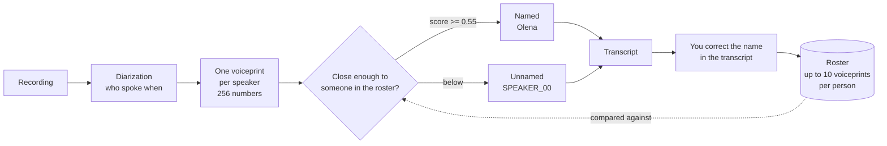
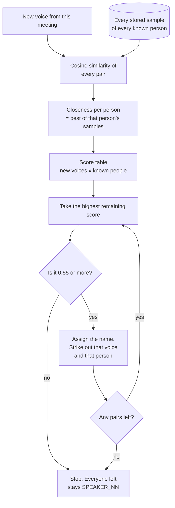
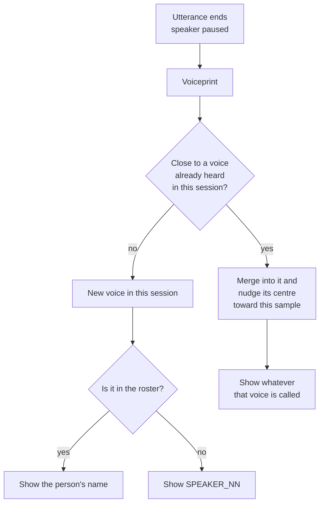

# How the app knows who is speaking

Everything below rests on one idea: a model turns any clip of one person talking
into **256 numbers**. Not the words, not the sounds — a fingerprint of the timbre.
The same person produces similar numbers whatever they say, today or next month.
Two different people produce numbers that point elsewhere.

That fingerprint is called a *voiceprint* or *embedding*. Ours comes from
**WeSpeaker ResNet34**, which ships inside pyannote's
`speaker-diarization-community-1` and runs at 16 kHz. Everything else in this
document is bookkeeping around those 256 numbers.

## The loop

The dotted arrow is the whole feature. A correction is not just a label change —
it is the cheapest enrolment there is, because the voiceprint for that speaker was
already computed during diarization and is sitting in the job.

### 1. Where a voiceprint comes from

Diarization already has to split the meeting by voice. Alongside "who spoke when",
pyannote hands back one embedding per speaker it found. The pipeline keeps them on
the job as `voiceprints` — no extra computation, they were a by-product.

### 2. How a person gets into the roster

Two ways, and the second is the one people actually use:

- upload 15–30 seconds of one person in **Voices** — the clip is diarized first, and
  refused if a second voice is in it or if it holds less than `MT_ENROL_MIN_SECONDS`
  of speech, because a bad sample here mislabels every meeting after it;
- **rename a speaker in a transcript** — `_enrol_corrections` in
  [app/api/jobs.py](app/api/jobs.py) takes the voiceprint already stored on the job
  and files it under the new name.

A person keeps up to **10 voiceprints** (`MT_SAMPLES_PER_PERSON`) — different
microphones, different rooms, different head colds. Once that is full the roster does
not stop learning: the new sample displaces whichever stored one is closest to another,
since that is the one teaching the least. A tie drops the older of the pair.

### 3. How the next meeting is matched

Both vectors are scaled to unit length and multiplied together — that is cosine
similarity, a number from −1 to 1. A new voice is compared against **every** stored
sample of a person and keeps the **best** one, so one good recording is enough to
be recognised even if the others were poor.

The assignment is **greedy and exclusive**: highest score first, and once a voice
or a person is used it is struck out. That is what stops two speakers both
becoming "Olena". Below `MT_SPEAKER_MATCH_THRESHOLD` (0.55) the handing-out simply
stops and the rest stay `SPEAKER_00`, `SPEAKER_01` and so on.

### 4. Live is a different shape

A live session has no finished meeting to diarize, so it clusters as it goes
(`Roll` in [app/voices.py](app/voices.py)):

Each voice carries a running centre that moves halfway toward every new sample
assigned to it, so the longer someone talks the more stable their cluster gets.

## The numbers that decide behaviour

| | where | what it does |
| --- | --- | --- |
| `MT_SPEAKER_MATCH_THRESHOLD` | 0.55 | below this, no name is given |
| `MT_SAMPLES_PER_PERSON` | 10 | voiceprints kept per person, worst evicted after that |
| `MT_ENROL_MIN_SECONDS` | 4 seconds | less speech than this cannot be enrolled |
| `MT_VOICE_MIN_SECONDS` | 1 second | shorter clips are not embedded at all |
| embedding size | 256 | WeSpeaker ResNet34, 16 kHz |

## Is this the only way? No — but it is the standard one

Speaker embeddings plus cosine similarity is what everyone does. "Standard" does
not mean "wrung dry", though. Roughly in order of value for effort:

**Close the set of candidates.** This is the biggest win and it is not machine
learning at all. Today the problem is *open*: a new voice is compared against
everyone ever enrolled. Take the invitee list from a calendar — or just let someone
tick five names before processing — and it becomes a choice among five instead of
fifty. Accuracy jumps without touching a model.

**Use a centroid as well as the maximum.** Keeping the best of ten samples is
sensitive to one lucky or unlucky recording. Averaging the samples and using both
the average and the best is more robust, and it is a few lines.

**Score normalisation (AS-norm).** The textbook answer to "the threshold that works
on one microphone fails on another": each score is normalised against a cohort of
other speakers, which makes a fixed 0.55 mean the same thing everywhere. This is
what production speaker-identification systems do, and it is the right move if
identity ever becomes critical rather than convenient.

**A stronger embedding model.** ResNet34 is solid. ECAPA-TDNN and ResNet293 do
better on difficult audio, at the cost of another model and more compute.

**Show doubt instead of guessing.** The threshold is a cliff: a name, or nothing.
A "probably Olena (0.58)" state with one-click confirmation would be both more
honest and a free source of enrolment samples.

## Where enrolment is strict, and why

Two of the recommendations above are now the behaviour, because both failures are
silent and permanent — a bad sample is compared against every meeting from then on:

- **Enrolment runs diarization first** (`signature()` in [app/voices.py](app/voices.py)).
  More than one voice in the clip, or less than `MT_ENROL_MIN_SECONDS` of speech, and the
  upload is refused with the reason. The voiceprint returned is pyannote's own speaker
  centroid — the same vector meetings are matched against, with overlapping speech
  already excluded by the pipeline (`embedding_exclude_overlap` in the community-1
  config), rather than a raw embedding of whatever was in the file.
- **A full roster keeps learning.** `remember()` used to stop at the tenth sample and
  never replace any, so after ten meetings a voice froze with whatever it was recorded
  on first. The new sample now displaces the most redundant stored one instead.
